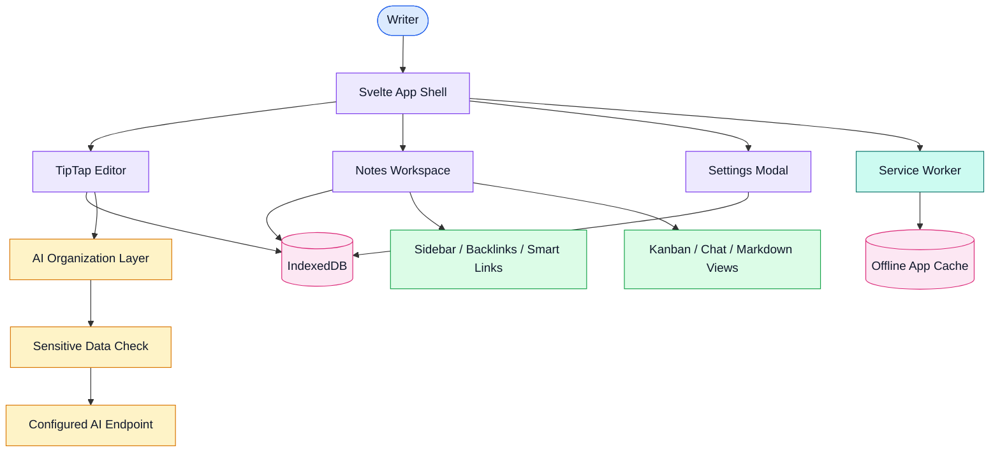

# Wocus

[](https://svelte.dev/)
[](https://vite.dev/)
[](https://tiptap.dev/)
[](https://developer.mozilla.org/en-US/docs/Web/API/IndexedDB_API)
[](https://web.dev/explore/progressive-web-apps)
[](https://vercel.com/)

Wocus is a private, local-first note-taking app for fast capture, focused writing, and on-demand AI organization. Notes stay in the browser by default, with optional bring-your-own-key AI calls for structure, tagging, transcription, and text organization.

Live demo: [wocus.vercel.app](https://wocus.vercel.app)

## Overview

Wocus is designed around a simple idea: write without friction first, organize later. The app stores notes locally in IndexedDB, works offline after the first visit, and avoids accounts, tracking, and a backend server.

When AI is enabled, the browser sends selected note content directly to the user-configured endpoint. The app does not proxy or store API keys on a server.

## Features

| Feature | Details |
| --- | --- |
| Local-first notes | Stores notes, settings, and templates in IndexedDB. |
| Distraction-free editor | TipTap editor with autosave, keyboard shortcuts, themes, and fullscreen mode. |
| Slash commands | Supports headings, dividers, toggles, todos, lists, code blocks, links, images, and rich text editing. |
| AI organization | Converts raw notes into structured sections, headings, todos, toggles, dividers, and tags. |
| Dual-view workflow | Keeps the original capture flow while supporting organized/structured note output. |
| Multi-note workspace | Supports note creation, switching, nested pages, sidebars, and navigation. |
| Templates | Includes default templates such as meeting notes, weekly review, project plan, and journal entry. |
| Knowledge navigation | Includes smart links, backlinks, sidebar navigation, and heading extraction. |
| Additional work views | Includes kanban and chat-style panels for alternative thinking modes. |
| Privacy controls | Detects sensitive data patterns before AI use and keeps API settings local. |
| Offline support | Service worker caches the app shell for offline use. |

## System design



### Runtime flow

| Step | Component | Responsibility |
| --- | --- | --- |
| 1 | Svelte app shell | Loads settings, notes, workspace state, and the editor. |
| 2 | TipTap editor | Handles rich text editing, slash commands, markdown conversion, and autosave events. |
| 3 | IndexedDB layer | Persists notes, settings, templates, and workspace metadata locally. |
| 4 | AI layer | Sends text to the configured endpoint only when the user triggers an AI action. |
| 5 | Sensitive-data check | Detects API keys, JWTs, private keys, and long numeric sequences before AI use. |
| 6 | Service worker | Caches the app shell and enables offline usage. |

## Tech stack

| Layer | Choice | Notes |
| --- | --- | --- |
| Frontend | Svelte 5 | Main application UI and reactive state. |
| Build tool | Vite 8 | Development server and production build. |
| Editor | TipTap / ProseMirror | Rich text editing and custom slash commands. |
| Storage | IndexedDB via `idb` | Local notes, settings, templates, and workspace data. |
| AI integration | Native `fetch` | Direct browser-to-provider calls with bring-your-own API key. |
| Markdown support | `marked`, `turndown` | Markdown rendering and conversion flows. |
| Offline support | Service Worker | Cache-first app shell behavior. |
| Deployment | Static SPA on Vercel | Can also run on Netlify, Cloudflare Pages, or any static host. |

## AI configuration

Wocus supports OpenAI-compatible endpoints and local model endpoints.

| Provider path | Example |
| --- | --- |
| OpenRouter | `https://openrouter.ai/api/v1/chat/completions` |
| OpenAI | `https://api.openai.com/v1/chat/completions` |
| Ollama | `http://localhost:11434/api/generate` |
| Other compatible providers | Anthropic-compatible gateways, Together AI, local proxies, or custom endpoints. |

Your API key is stored locally in browser storage and is sent only to the endpoint you configure.

## Keyboard shortcuts

| Action | macOS | Windows/Linux |
| --- | --- | --- |
| Organize with AI | `⌘⇧O` | `Ctrl+Shift+O` |
| Toggle raw / organized view | `⌘⇧V` | `Ctrl+Shift+V` |
| Cycle theme | `⌘⇧E` | `Ctrl+Shift+E` |
| Cycle font | `⌘⇧A` | `Ctrl+Shift+A` |
| Fullscreen | `⌘⇧F` | `Ctrl+Shift+F` |
| Download | `⌘S` | `Ctrl+S` |
| Print | `⌘P` | `Ctrl+P` |

## Quick start

Install dependencies:

```bash
npm install
```

Start the development server:

```bash
npm run dev
```

Open:

```text
http://localhost:5173
```

Build and preview production output:

```bash
npm run build
npm run preview
```

## Deployment

Build the static app:

```bash
npm run build
```

Deploy the generated output to Vercel, Netlify, Cloudflare Pages, or any static host.

For Vercel:

```bash
npx vercel --prod
```

## Privacy model

| Area | Behavior |
| --- | --- |
| Notes | Stored locally in IndexedDB. |
| Accounts | No login or account required. |
| Tracking | No analytics, telemetry, or tracking by default. |
| Offline mode | Service worker caches the app shell, not private note content. |
| API keys | Stored locally and sent only to the configured AI endpoint. |
| AI requests | Note text is sent only when the user explicitly triggers an AI action. |

## Project structure

```text
wocus/
├── src/
│   ├── App.svelte              # Main shell, workspace state, keyboard shortcuts
│   ├── app.css                 # Theme variables and global styles
│   ├── main.js                 # Entry point and service worker registration
│   └── lib/
│       ├── Editor.svelte       # TipTap editor wrapper
│       ├── slash.js            # Slash command extension
│       ├── ai.js               # AI calls, JSON extraction, transcription, sensitive-data checks
│       ├── db.js               # IndexedDB notes, settings, and templates
│       ├── settings.svelte.js  # Reactive settings store
│       ├── Sidebar.svelte      # Heading navigation
│       ├── NoteSidebar.svelte  # Note switching and workspace navigation
│       ├── SmartLinks.svelte   # Smart link navigation
│       ├── Backlinks.svelte    # Backlink display
│       ├── KanbanBoard.svelte  # Kanban-style view
│       └── ChatPanel.svelte    # Chat-style thinking panel
├── public/
│   └── sw.js                   # Offline cache service worker
├── package.json
└── README.md
```

## README style direction

This repository follows the shared portfolio README structure:

- Short product description at the top.
- Technology labels for fast scanning.
- Feature, runtime-flow, and privacy tables.
- Coloured system design diagram when architecture is useful.
- Practical setup, deployment, and project structure sections.

## License

MIT
